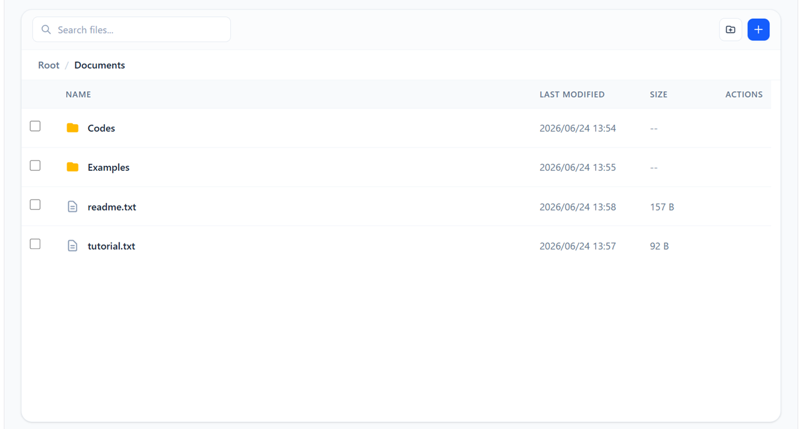

# Kamu File Manager

<p align="center">
  
</p>

Kamu File Manager is a plug-and-play, lightweight, web-based file manager designed to allow easy file access via any web browser. Kamu File Manager is built for effortless deployment and can run on any machine via a Docker image.

---

## Tech Stack

- **Frontend:** React + Tailwind CSS
- **Backend:** Node.js + NestJS

---

## Main Features

- Easy to deploy via Docker image with simple configuration to map folder into container.
- Built-in code editor feature for editing file and comparing file change on server with automatic encoding detection support (support UTF-8, UTF-8 with BOM, UTF-16LE, and UTF-16BE).
- Guarantee 100% file integrity with additional checksum validation for upload and download.
- Robust Testing with unit and integration test coverage for edge cases to ensure data reliability.
- **[Planned]** Support for multiple type of storage.

---

## How to Setup Development Environment

1. Prepare Visual Studio Code (VS Code) with devcontainer extension.
2. Activate "open in container" command to activate devcontainer environment.
3. Install dependecies on frontend and backend using pnpm install.
4. Run both frontend and backend server to access Kamu File Manager via web browser.

---

## How to Build the Docker Image

1. Define absolute path to HOST_STORAGE_PATH variable in .env for docker-compose.prod.yml. (see .env.example for example)
2. Build or run the Docker image using docker-compose.prod.yml.

```text
export UID=$(id -u) GID=$(id -g)
docker compose -f docker-compose.prod.yml up
```

---

## License

Apache-2.0 license